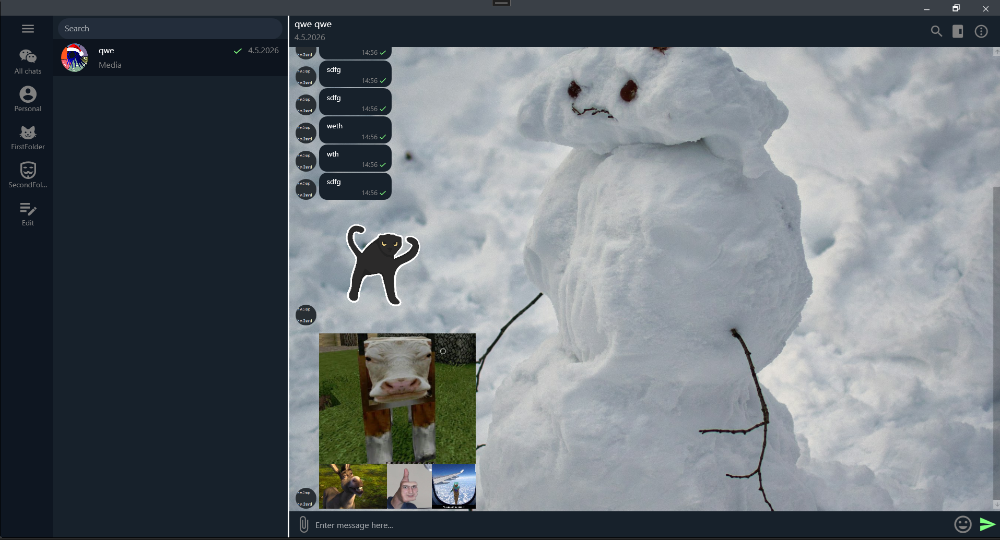
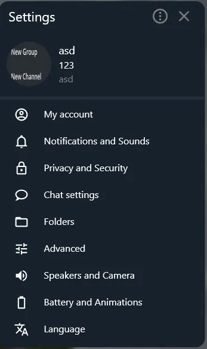
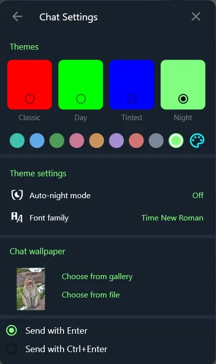
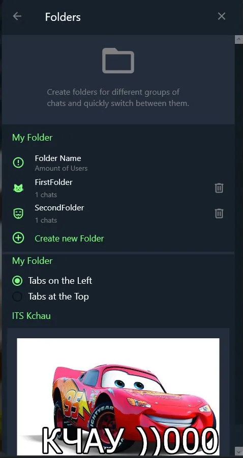

# TelegramClientServer

A Telegram-inspired messenger built with C# as a learning project and a base for a master's thesis. The goal was to replicate Telegram's look and feature set as closely as possible.

## Screenshots






> Add screenshots to the `Images/` folder with these filenames to display them here.

## Features

**Messaging**
- User-to-user chats
- Image and video sharing
- Reply and forward messages
- Scheduled messages
- Auto-delete messages

**Authentication**
- Login / registration
- JWT-based authentication

**Customization**
- Color themes (Classic, Day, Tinted, Night) with accent color picker
- Chat wallpapers — choose from gallery or file
- Font family selection, auto-night mode
- Folders for organizing chats (tabs on left or top)

**Settings**
- My account, Privacy and Security
- Notifications and Sounds
- Chat settings, Folders
- Advanced, Language
- Block and delete users

## Stack

**Client**
- C# / WPF — desktop UI

**Server**
- ASP.NET — REST API
- SignalR — real-time messaging
- JWT — authentication
- Entity Framework + SQL Server — data persistence
- ngrok — used for local server testing

## Getting Started

1. Clone the repo and open the solution in Visual Studio
2. Set up the database in SSMS and update the connection string
3. Run the server project first, then the client
4. Hit F5

## Project Structure

```
Server/     # ASP.NET API, SignalR hubs, EF DbContext
Client/     # WPF application, windows, views
```
